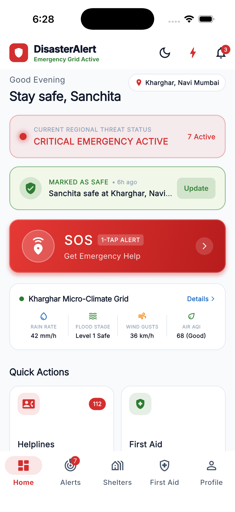
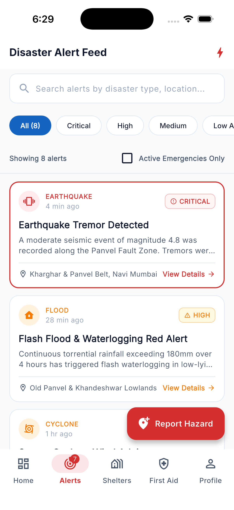
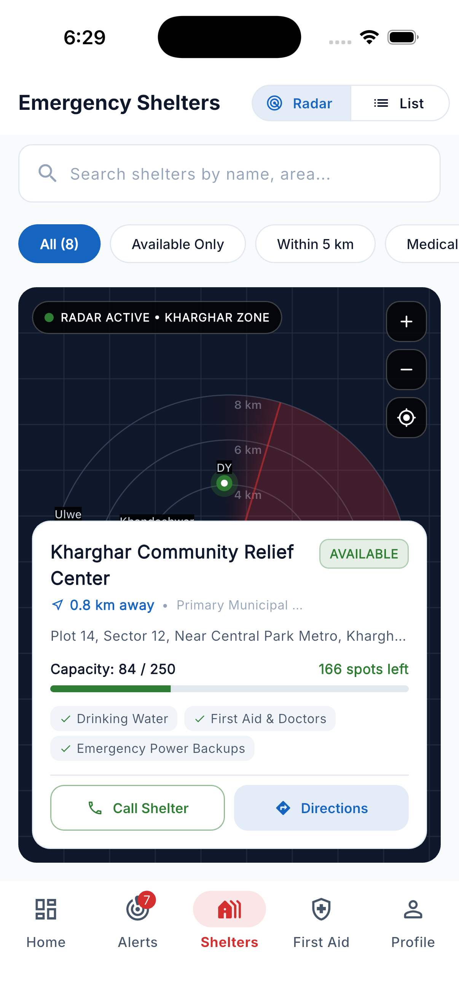
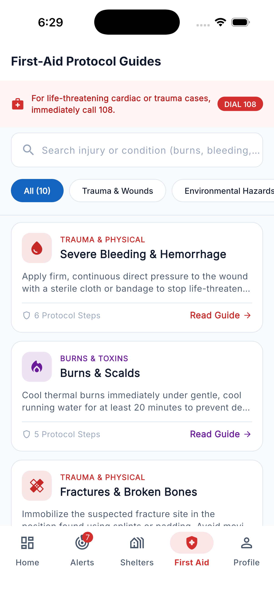
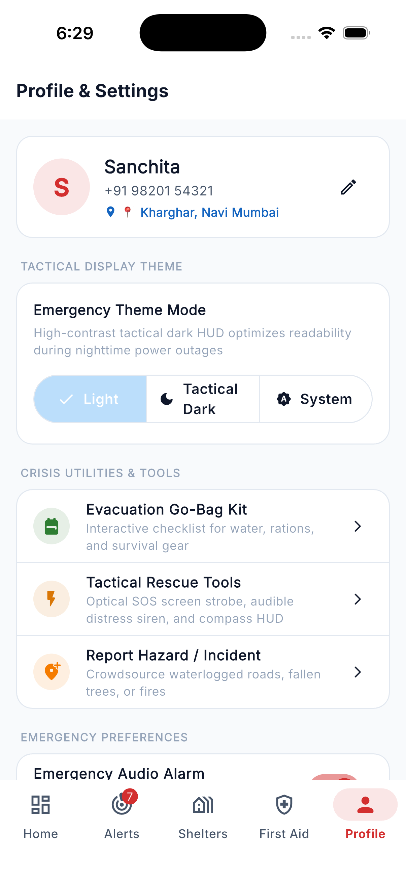

# DISASTERALERT (Application 24 • Problem Statement 74)

> **"Stay Alert. Stay Safe."**  
> A complete, production-grade cross-platform emergency and disaster-assistance mobile platform built with **Flutter**, **Dart**, and **Material 3**. Suitable for university B.Tech capstone project demonstrations and real-world disaster relief operations.

---

## 📌 Problem Statement & Context
- **Application Number:** 24
- **Problem Statement ID:** 74
- **Project Domain:** Disaster Management, Emergency Response & Public Safety Telemetry
- **Evaluation Benchmark:** B.Tech Major Project Demonstration

During civil catastrophes—such as earthquakes, monsoonal flash floods, cyclonic sea surges, and industrial hazards—cellular internet may be degraded, official communication congested, and citizens left disoriented. **DisasterAlert** bridges the critical first-response gap with an intuitive, high-contrast, offline-first mobile assistant centered around Kharghar and the greater Mumbai/Navi Mumbai metropolitan zone.

---

## 🌟 Key Application Features

1. **🚨 Live Disaster Alert Feed & Early Warning System**
   - Multi-hazard monitoring: Earthquakes, Flash Floods, Cyclones, Industrial Fires, Landslides, Chemical Gas Leaks, and Extreme Heatwaves.
   - Distinct severity triage: `🔴 CRITICAL`, `🟠 HIGH`, `🟡 MEDIUM`, and `🟢 LOW ADVISORY`.
   - Real-time simulation engine to generate incoming emergency alerts during live demonstrations.
   - Comprehensive safety instructions and mandatory civil defence protocols.

2. **🆘 High-Priority Emergency SOS Broadcast System**
   - Prominent, pulsating SOS button with safe 2-step confirmation to eliminate false triggers.
   - Real-time telemetry broadcast incorporating GPS coordinates (`19.0473° N, 73.0699° E`), timestamp, and battery-friendly dispatch.
   - Instant dispatch to local responders and the National Unified Helpline (`112`).

3. **👥 Emergency & Trusted Contact Management**
   - One-tap calling and distress SMS dispatch to national toll-free helplines: Police (`100`), Ambulance (`108`), Fire (`101`), Disaster Relief (`112`), NDRF HQ, Women Helpline (`1091`), and Childline (`1098`).
   - Personal trusted contacts management with `SharedPreferences` local storage: Add, edit, delete, and designate Primary SOS contacts with form validation.

4. **📍 Interactive Shelter Radar & Locator**
   - Dual-view mode: **Tactical Radar Sweep Map** (built with custom Flutter `CustomPainter` without requiring external API keys) and a high-efficiency **List View**.
   - Proximity sorting using the Haversine distance formula from Kharghar center.
   - Live capacity tracking (total capacity, active occupancy, remaining beds).
   - Facility checklist: Potable Drinking Water, Emergency Medical Clinic, Diesel Power Backups, Cooked Meals, and Childcare.
   - 1-tap Google Maps turn-by-turn navigation route launcher with offline GPS fallback.

5. **🩹 Offline-First Emergency Medical First-Aid Guides**
   - 10 comprehensive protocols: Severe Bleeding, Burns & Scalds, Fractures, Adult Hands-Only CPR, Fainting/Syncope, Venomous Snake Bite, High-Voltage Electric Shock, Heat Stroke, Choking (Heimlich Maneuver), and Severe Dehydration.
   - Step-by-step instructions, essential contraindications ("What NOT to do"), red-flag hospital symptoms, and direct 108 ambulance dialer.

6. **🔔 Push Notification Center & Profile Preferences**
   - Categorized notifications for alerts, shelter capacity changes, and safety checks.
   - Individual preference toggles for high-decibel emergency alarms, haptic SOS vibration, geo-tracking telemetry, and push broadcasts.

---

## 📸 Application Screenshots & UI Showcase

<div align="center">

| 1. Emergency HUD & Command Center | 2. Live Disaster Alert Feed | 3. Radar-Assisted Shelter Locator |
| :---: | :---: | :---: |
|  |  |  |
| **Tactical HUD & Safety Grid**<br>Live threat triage, 1-tap SOS, regional micro-climate grid, and instant status check-in. | **Multi-Hazard Alert Feed**<br>Early warning alerts categorized by severity (`CRITICAL`, `HIGH`, `MEDIUM`) with search & filters. | **Tactical Radar Sweep Map**<br>Real-time shelter capacity tracking, amenities checklist, and 1-tap turn-by-turn map directions. |

<br>

| 4. Offline First-Aid Protocol Guides | 5. Tactical Settings & Crisis Utilities |
| :---: | :---: |
|  |  |
| **Emergency Medical Protocols**<br>10 offline trauma guides with step-by-step instructions, warnings, and direct 108 dialer. | **Crisis Toolkit & Tactical HUD**<br>Evacuation Go-Bag checklist, optical/audible rescue beacon, incident reporting, and audio alarms. |

</div>

---

## 🗺️ How Shelter Selection & Turn-by-Turn Map Direction Works

When a citizen is facing an active crisis (e.g. rising floodwaters or an earthquake tremor) and taps **"Directions"** on a relief shelter, the app executes the following precision workflow:

```
[User Views Radar / List] 
           ↓
[Taps Shelter Pin / Card] ───→ Selected Shelter Model (Name, Lat, Long, Capacity)
           ↓
[Taps "Directions" Button] 
           ↓
[Helpers.openMapDirections(context, lat, long, name)]
           ├── 1. Constructs Universal Google Maps URL:
           │      https://www.google.com/maps/dir/?api=1&destination={lat},{long}&destination_place_id={name}
           ├── 2. url_launcher.canLaunchUrl() checks OS URL scheme support
           ├── 3. url_launcher.launchUrl(..., mode: LaunchMode.externalApplication):
           │      • Android: Dispatches ACTION_VIEW Intent directly to native Google Maps app
           │      • iOS: Launches Google Maps app or native Apple Maps turn-by-turn navigation
           └── 4. Graceful Offline Fallback:
                  If device has no map app/network, displays high-contrast modal with 
                  precise GPS coordinates and local routing vectors from Kharghar telemetry.
```

---

## 🏗 Clean Architecture & Folder Structure

DisasterAlert follows clean architectural principles with strict separation between business logic, service layers, and presentation widgets:

```
lib/
├── main.dart                          # App entry point with MultiProvider injection
├── app/
│   ├── app.dart                       # MaterialApp configuration & theme linking
│   ├── routes.dart                    # Centralized named routing & parameter resolution
│   └── theme.dart                     # Material 3 light emergency theme & color tokens
├── models/
│   ├── alert.dart                     # Disaster alerts & severity levels
│   ├── emergency_contact.dart         # Toll-free helpline directory
│   ├── trusted_contact.dart           # User emergency contacts & persistence model
│   ├── shelter.dart                   # Relief centers, capacity & facility checklist
│   ├── first_aid.dart                 # Medical guidance & step protocols
│   └── notification_model.dart        # Notification entity & read states
├── providers/
│   ├── alert_provider.dart            # Alert feed state, filtering & simulated events
│   ├── contact_provider.dart          # Contact management & SharedPreferences sync
│   ├── shelter_provider.dart          # Shelter search, distance filtering & map selection
│   ├── notification_provider.dart      # Notification history & unread counter
│   ├── location_provider.dart          # GPS coordinates & Haversine distance calculations
│   └── theme_provider.dart             # User profile, sound/vibration toggles & onboarding
├── screens/
│   ├── splash/splash_screen.dart                 # Animated shield logo & initialization
│   ├── onboarding/onboarding_screen.dart         # 3-step feature walkthrough
│   ├── home/dashboard_screen.dart                # Core emergency command center
│   ├── alerts/alert_feed_screen.dart             # Searchable alert feed with severity chips
│   ├── alerts/alert_detail_screen.dart           # Detailed disaster overview & safety steps
│   ├── contacts/emergency_contacts_screen.dart   # National helplines directory
│   ├── contacts/trusted_contacts_screen.dart     # Personal emergency contact manager
│   ├── shelters/shelter_locator_screen.dart      # Radar canvas & shelter list switcher
│   ├── shelters/shelter_detail_screen.dart       # Shelter facilities & route directions
│   ├── first_aid/first_aid_screen.dart           # Medical condition cards & search triage
│   ├── first_aid/first_aid_detail_screen.dart    # Step-by-step procedures & warnings
│   ├── notifications/notification_screen.dart    # Notification center with mark-all-read
│   ├── profile/profile_screen.dart               # Emergency preferences & project info
│   └── main_navigation_screen.dart               # Material 3 persistent bottom navigation
├── widgets/
│   ├── status_badge.dart                         # Accessible high-contrast status chips
│   ├── emergency_button.dart                     # Pulsating SOS button with glowing aura
│   ├── alert_card.dart                           # Disaster preview cards with urgency borders
│   ├── quick_action_card.dart                    # Home grid cards for fast navigation
│   ├── shelter_card.dart                         # Occupancy progress bar & facility preview
│   ├── contact_card.dart                         # Helpline & trusted contact action cards
│   ├── first_aid_card.dart                       # Medical triage cards
│   ├── notification_tile.dart                    # Unread indicators & time ago formatting
│   ├── section_header.dart                       # Section titles with navigation action
│   ├── search_field.dart                         # Debounced search bar with filter button
│   ├── custom_filter_chip.dart                   # Categorical chip selector
│   ├── empty_state_widget.dart                   # Friendly empty/safe state illustrations
│   ├── safety_tip_card.dart                      # Auto-rotating disaster safety guidelines
│   ├── interactive_shelter_map.dart              # CustomPainter radar sweep & markers
│   └── emergency_sos_dialog.dart                 # SOS transmission modal & telemetry summary
├── services/
│   ├── alert_service.dart                        # Alert queries & real-time simulation
│   ├── contact_service.dart                      # Local JSON persistence via SharedPreferences
│   ├── shelter_service.dart                      # Facility filters & proximity calculations
│   ├── notification_service.dart                 # Notification manager
│   └── location_service.dart                     # Geographic math & default Kharghar coordinates
├── data/
│   ├── mock_alerts.dart                          # 8 realistic regional alerts (Navi Mumbai)
│   ├── mock_contacts.dart                        # 8 emergency helplines + 5 trusted contacts
│   ├── mock_shelters.dart                        # 8 realistic evacuation centers
│   ├── mock_first_aid.dart                       # 10 medical emergency guides
│   └── mock_notifications.dart                   # 10 in-app notification events
└── utils/
    ├── constants.dart                            # Color tokens, spacing, helpline numbers
    ├── validators.dart                           # Phone, name, and relationship validators
    └── helpers.dart                              # url_launcher dialer, SMS, map navigation
```

---

## 🛠️ Technology Stack & Dependencies

| Layer | Technology | Details |
|---|---|---|
| **Framework** | Flutter (Channel stable, 3.47+) | Cross-platform UI toolkit |
| **Language** | Dart (3.13+) | Null-safe, modern typed language |
| **Design System** | Material 3 | High-contrast accessible emergency styling |
| **State Management** | Provider (`^6.1.5`) | Reactive state handling with `ChangeNotifier` |
| **Typography** | Google Fonts (`^6.2.1`) | Clean, legible *Inter* sans-serif typeface |
| **Persistence** | SharedPreferences (`^2.5.5`) | Local encrypted caching for user profile & contacts |
| **Hardware Hooks** | url_launcher (`^6.3.2`) | Native phone dialer, SMS app, and Google Maps |
| **Audio Engine** | audioplayers (`^6.1.1`) | Real looping emergency distress siren & haptic sync |
| **Formatting** | intl (`^0.20.3`) | Dates, timestamps, and regional numbering |

---

## 🚀 Getting Started & Execution

### Prerequisites
- Flutter SDK `3.19.0` or higher installed and added to `PATH`.
- macOS, Linux, Windows, or Chrome browser.

### 1. Clone & Dependencies
```bash
cd DISASTERALERT
flutter pub get
```

### 2. Verify Codebase Integrity
```bash
flutter analyze
flutter test
```
*(Both commands pass with 0 errors and 31 passing tests!)*

### 3. Run the Application
To run on your connected device (macOS Desktop or Chrome):
```bash
# Run on macOS desktop
flutter run -d macos

# Run on Google Chrome browser
flutter run -d chrome

# List all available devices
flutter devices
```

---

## 🧭 Complete Demonstration Workflow

For evaluators and viva presentations, follow this end-to-end user journey:

```
[1] Splash Screen (Animated logo & tagline "Stay Alert. Stay Safe.")
       ↓
[2] Onboarding (3-step walkthrough: Stay Informed → Get Help → Find Safety)
       ↓
[3] Emergency Dashboard (Greeting, Location: Kharghar, Status: CRITICAL EMERGENCY ACTIVE)
       ├── ⚡ Tap "Simulate Alert" (AppBar lightning bolt) → Live disaster added & notification delivered
       ├── 🔴 Tap "SOS" Button → Confirmation dialog → Loading telemetry → SOS Dispatched with GPS!
       ├── 🚨 Quick Action: Helplines → View 8 national emergency services, dial 112
       ├── 📍 Quick Action: Find Shelter → Open Tactical Radar map & toggle List view
       ├── 🏥 Quick Action: First Aid → Select "CPR" or "Snake Bite", review steps & warnings
       └── 💡 Review auto-rotating Safety Tip card
       ↓
[4] Alerts Tab → Search "flood" or filter by "Critical", open Alert Details, tap "Share Alert"
       ↓
[5] Shelters Tab → Switch between Radar and List mode, filter by "Within 5 km", view details
       ↓
[6] Contacts Tab → Open "Trusted Contacts", add a new emergency contact with validation
       ↓
[7] Notifications Tab → Review unread events, mark all as read
       ↓
[8] Profile Tab → Edit name & phone number, toggle emergency siren and haptic vibration
```

---

## 🔒 Future Firebase & Cloud Backend Roadmap

The application architecture has been decoupled via service layers (`AlertService`, `ContactService`, `LocationService`) allowing drop-in cloud enhancements:
- **Cloud Firestore**: Real-time synchronization of national disaster bulletins from IMD / NDMA.
- **Firebase Authentication**: Phone OTP login for verified citizen distress beacons.
- **Firebase Cloud Messaging (FCM)**: Background geo-targeted emergency push notifications.
- **Firebase Realtime Database**: Live GPS tracking of dispatched relief ambulances and NDRF rescue boats.

---

## 👥 Academic Project Attribution
- **Application Number:** 24
- **Problem Statement:** 74
- **Project Title:** DISASTERALERT
- **Lead Developer & Architect:** Sanchita Suryawanshi (B.Tech Computer Engineering)
- **Supervising Faculty:** Department of Computer Engineering
